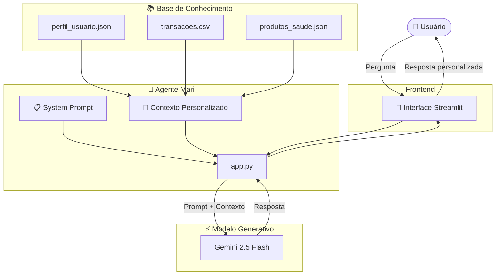

# 💪 Mari – Agente de IA para Educação Financeira em Saúde


Uma agente de Inteligência Artificial desenvolvida para promover educação financeira aplicada à saúde, oferecendo orientações personalizadas e seguras com base em uma base de conhecimento local.


## 📌 Sobre o Projeto

**Mari** é uma educadora financeira em saúde construída com Python, Streamlit e Google Gemini.

Seu propósito é ajudar usuários a compreenderem melhor seus gastos e investimentos em saúde, apresentando produtos e serviços disponíveis de maneira educativa, acessível e responsável.

A Mari foi projetada para responder **exclusivamente utilizando os dados presentes na pasta `data/`**, reduzindo o risco de alucinações e aumentando a confiabilidade das respostas.

---

## 🎯 Caso de Uso

Muitas pessoas desejam investir mais em sua saúde, mas têm dificuldade em organizar seus gastos e conhecer serviços que podem contribuir para sua qualidade de vida.

A Mari auxilia o usuário a:

- Entender seus custos atuais;
- Conhecer produtos e serviços disponíveis;
- Receber orientações personalizadas conforme seu perfil;
- Desenvolver hábitos financeiros mais conscientes;
- Planejar investimentos em saúde de forma sustentável.

---

## ✨ Funcionalidades

- 💬 Chat interativo com Streamlit;
- 🧠 Integração com Google Gemini 2.5 Flash da Google AI Studio;
- 📊 Leitura automática dos dados do usuário;
- 📁 Base de conhecimento local em JSON e CSV;
- 🎯 Respostas contextualizadas com base no perfil do usuário;
- 🛡️ Proteção contra alucinações através de regras no prompt;
- 🤝 Linguagem simples e amigável.

---

## 🛡️ Segurança e Confiabilidade

A Mari foi desenvolvida seguindo princípios de IA responsável.

Ela:

- Utiliza apenas informações da base de conhecimento do projeto;
- Não inventa preços ou serviços;
- Assume quando não possui determinada informação;
- Não recomenda tratamentos medicamentosos específicos;
- Não prescreve exercícios ou terapias;
- Incentiva sempre o acompanhamento por profissionais de saúde.

---

## 🏗️ Arquitetura da Agente Mari



---

## 📂 Estrutura do Projeto

```text
📦 Health-invest-AI-wallet-agent
│
├── 📄 README.md                    # Documentação principal
├── 📄 requirements.txt             # Dependências do projeto
│
├── 📁 data                         # Base de conhecimento da Mari
│   ├── 📄 perfil_usuario.json      # Perfil e objetivos do usuário
│   ├── 📄 produtos_saude.json      # Produtos e serviços disponíveis
│   └── 📄 transacoes.csv           # Histórico financeiro
│
├── 📁 docs                         # Documentação do agente
│   ├── 📄 01-documentacao-agente.md
│   ├── 📄 02-base-conhecimento.md
│   ├── 📄 03-prompts.md
│   ├── 📄 04-metricas.md
│   └── 📄 05-pitch.md
│
├── 📁 images                       # Imagens utilizadas na avaliação funcional e testes para ver se respostas faziam sentido
│
├── 📁 src
│   └── 📄 app.py                   # Aplicação principal em Streamlit
│
└── 📄 .gitignore
```

---

## 📚 Base de Conhecimento

A Mari utiliza informações armazenadas em arquivos locais.

| Arquivo | Formato | Função |
|-----------|---------|---------|
| `perfil_usuario.json` | JSON | Perfil e objetivos do usuário |
| `transacoes.csv` | CSV | Histórico financeiro |
| `produtos_saude.json` | JSON | Produtos e serviços disponíveis |

---

## ⚙️ Tecnologias Utilizadas

- Python
- Streamlit
- Pandas
- Google Gemini API
- Python-dotenv
- JSON
- CSV

---

## 🚀 Como Executar

### 1. Clone o repositório

```bash
git clone https://github.com/seu-usuario/projeto-mari.git
```

### 2. Entre na pasta do projeto

```bash
cd projeto-mari
```

### 3. Instale as dependências

```bash
pip install -r requirements.txt
```

### 4. Configure a chave da API

Crie um arquivo `.env`:

```env
GOOGLE_API_KEY=sua_chave_aqui
```

### 5. Execute a aplicação

```bash
streamlit run src/app.py
```

---

## 🧠 Funcionamento do Agente

Ao receber uma pergunta, a Mari:

1. Carrega os dados do usuário presentes em `perfil_usuario.json`;
2. Lê o histórico financeiro em `transacoes.csv`;
3. Consulta os produtos e serviços disponíveis em `produtos_saude.json`;
4. Monta um contexto personalizado;
5. Envia esse contexto juntamente com um System Prompt ao Gemini 2.5 Flash;
6. Retorna uma resposta educativa, clara e baseada exclusivamente nas informações fornecidas.

---

## 💬 Exemplos de Perguntas

- "Como estão meus gastos com saúde?"
- "Quais serviços podem me ajudar a atingir meu objetivo?"
- "Existe algum produto adequado para mim?"
- "Como posso investir melhor na minha qualidade de vida?"
- "Quanto já gastei com farmácia?"

---

## 🎓 Personalidade da Mari

A Mari foi projetada para se comunicar como uma educadora financeira próxima e acolhedora.

### Tom de voz

- Amigável;
- Motivador;
- Didático;
- Simples e acessível;
- Consultivo e responsável.

---

## 📈 Diferenciais

✅ Pitch do projeto: Ouça a apresentação da Mari 

[Apresentação da Mari](https://drive.google.com/file/d/1oQq2yiG8RiQRsbuE0sXyV4VzTxOMpkbm/view?usp=drive_link)

✅ Educação financeira aplicada à saúde

✅ Respostas contextualizadas

✅ IA Generativa com Google Gemini

✅ Interface em Streamlit

✅ Base de conhecimento local

✅ Menor risco de alucinações

✅ Recomendações responsáveis

---

## 🔒 Limitações

A Mari **não substitui profissionais da saúde**.

Suas respostas possuem finalidade exclusivamente educativa e são limitadas às informações disponíveis na base de conhecimento do projeto.

---

## 👩‍⚕️ Mari

> "Investir em saúde também é investir em qualidade de vida. Estou aqui para te ajudar a tomar decisões mais conscientes e sustentáveis. 💙"

---

Projeto desenvolvido para o desafio de construção de agentes inteligentes utilizando IA Generativa.
